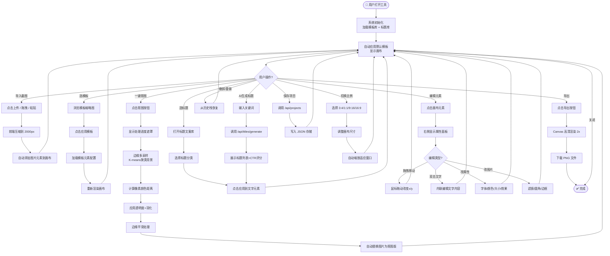
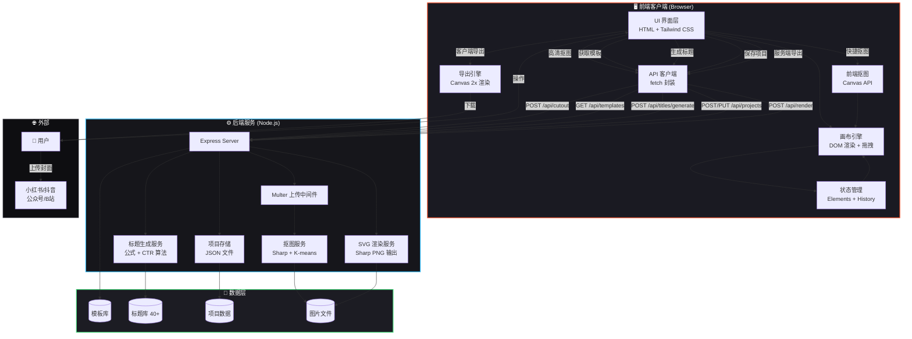
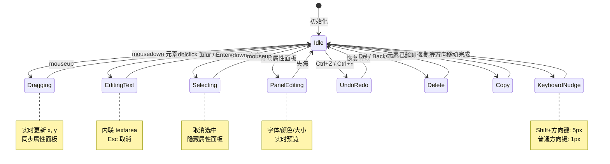
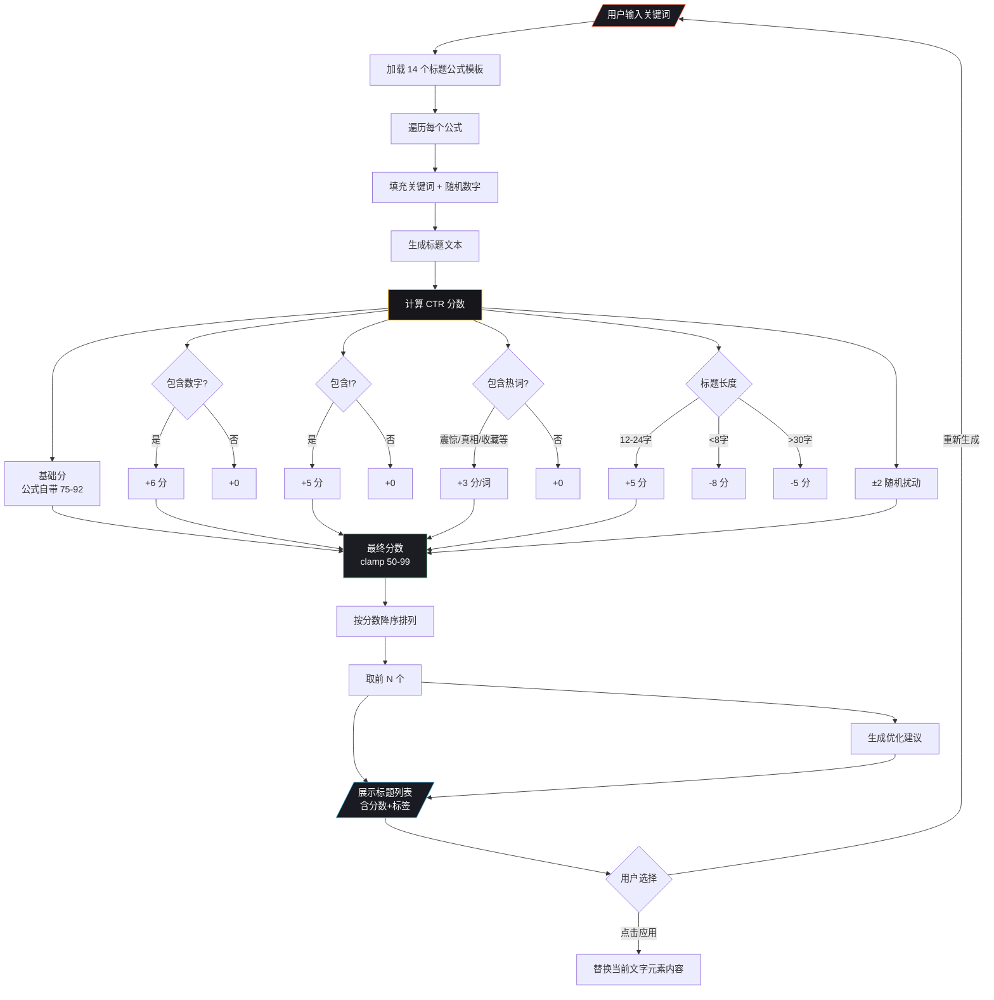
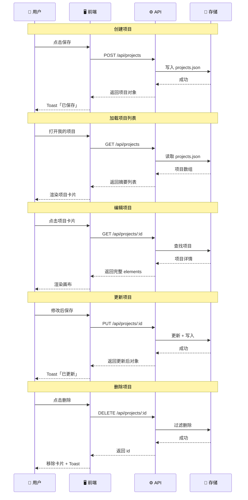
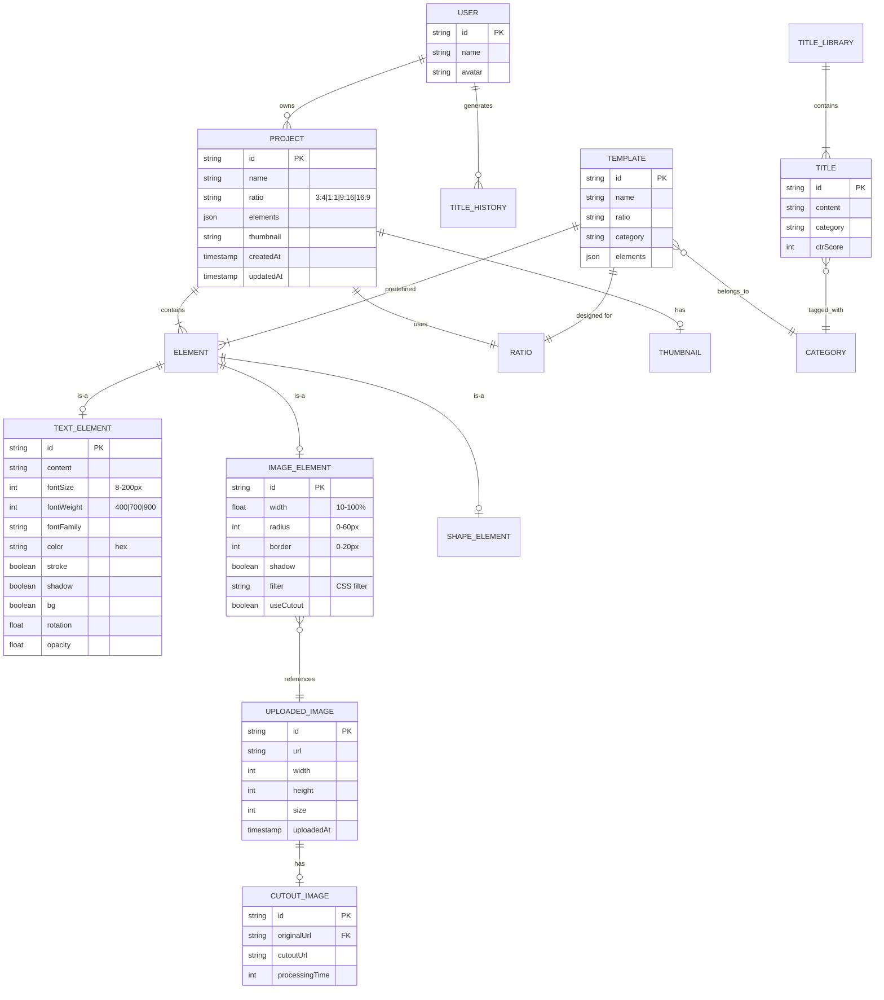

# 自媒体封面标题生成工具 — 用户故事 & PRD & 流程图

## 一、用户故事

### 1.1 角色画像

| 角色             | 描述                 | 核心诉求                |
| ---------------- | -------------------- | ----------------------- |
| **小白创作者**   | 刚入行，不会设计软件 | 一键出图，3分钟搞定     |
| **资深自媒体人** | 日更多平台，追求效率 | 批量产出，多尺寸适配    |
| **内容运营**     | 团队协作，统一风格   | 模板复用，品牌一致      |
| **短视频博主**   | 视频封面是点击率关键 | 高点击率标题+冲击力封面 |

### 1.2 用户故事卡片

```
US-01 | 作为小白创作者
       我希望导入一张截图后，系统自动套用爆款模板
       以便我不用学设计也能做出专业封面

US-02 | 作为自媒体人
       我希望从内置标题库中一键选择高点击率标题
       以便提升封面吸引力和打开率

US-03 | 作为短视频博主
       我希望一键抠图去除截图背景
       以便将主体人物/产品融入封面设计

US-04 | 作为多平台创作者
       我希望切换不同比例（3:4 / 1:1 / 9:16 / 16:9）
       以便同一设计适配小红书、抖音、公众号、B站

US-05 | 作为创作者
       我希望双击文字直接编辑内容
       以便快速调整标题文案

US-06 | 作为创作者
       我希望能拖拽元素调整位置
       以便自由排版而不用输入坐标

US-07 | 作为内容运营
       我希望保存项目并随时继续编辑
       以便多次修改不断完善

US-08 | 作为创作者
       我希望导出高清PNG/JPG
       以便直接上传到各平台

US-09 | 作为资深自媒体人
       我希望AI根据关键词生成多个标题方案并预测点击率
       以便数据驱动选择最优标题

US-10 | 作为创作者
       我希望调整字体、字号、颜色、描边、投影
       以便精细打磨封面视觉效果

US-11 | 作为小白创作者
       我希望看到模板缩略图预览
       以便快速选择喜欢的风格

US-12 | 作为创作者
       我希望撤销/重做操作
       以便放心尝试不同方案不怕改错
```

---

## 二、PRD 产品需求文档

### 2.1 产品定位

> **一句话定义**：导入截图 → 选模板 → 一键抠图 → 自动排版 → 导出封面，3分钟生成爆款封面。

### 2.2 核心功能模块

```
CoverForge
├── 📥 图片导入
│   ├── 本地上传（点击/拖拽）
│   ├── 粘贴截图（Ctrl+V）
│   └── 自动添加到画布
│
├── 🎨 模板系统
│   ├── 爆款标题模板（6+ 预设）
│   ├── 按比例分类（3:4 / 1:1 / 9:16 / 16:9）
│   ├── 按风格分类（悬念/数字/情感/干货/对比）
│   └── 模板缩略图实时预览
│
├── ✂️ 一键抠图
│   ├── K-means 聚类背景识别
│   ├── 边缘多采样点
│   ├── 颜色距离 + 羽化过渡
│   ├── 边缘平滑处理
│   └── 原图/抠图切换
│
├── 📝 标题文案
│   ├── 内置标题库（5大类 40+）
│   ├── AI 关键词生成（公式模板）
│   ├── CTR 点击率预测评分
│   └── 一键应用到文字元素
│
├── 🖼️ 画布编辑器
│   ├── 元素拖拽移动
│   ├── 双击文字内联编辑
│   ├── 选中元素属性面板
│   ├── 图层管理（显示/删除/选中）
│   └── 撤销/重做（30步历史）
│
├── 🔤 文字属性
│   ├── 字体切换（4+ 字体）
│   ├── 字号 8-200px（滑块+输入）
│   ├── 字重/斜体/下划线
│   ├── 对齐方式（左/中/右）
│   ├── 颜色（色板+取色器+Hex）
│   ├── 描边（开关+粗细+颜色）
│   ├── 投影开关
│   ├── 背景色块（开关+颜色+内边距）
│   └── 旋转 / 透明度
│
├── 🖽 图片属性
│   ├── 宽度百分比缩放
│   ├── 圆角调节
│   ├── 边框粗细
│   ├── 投影开关
│   ├── 8种滤镜（黑白/复古/高对比/鲜艳/暖调/冷调/模糊）
│   └── 旋转 / 位置
│
├── 📐 尺寸适配
│   ├── 3:4 竖屏（小红书/公众号）
│   ├── 1:1 方形（Instagram）
│   ├── 9:16 全屏（抖音/快手故事）
│   └── 16:9 横屏（B站/YouTube）
│
├── 💾 项目管理
│   ├── 创建/保存/更新/删除
│   ├── 项目列表
│   └── 缩略图记忆
│
└── 📤 导出
    ├── 客户端 Canvas 导出（2x高清PNG）
    ├── 服务端 SVG 渲染导出
    └── 一键下载
```

### 2.3 非功能需求

| 维度       | 要求                                   |
| ---------- | -------------------------------------- |
| **性能**   | 抠图 < 3秒（1000px内），画布操作 60fps |
| **兼容**   | Chrome 90+ / Edge / Safari 14+         |
| **并发**   | 单机支持 50 并发抠图请求               |
| **存储**   | 单项目 < 5MB，图片自动压缩到 2000px    |
| **安全**   | 文件类型校验、大小限制 10MB            |
| **可用性** | 零安装打开即用、离线可用基础编辑       |

### 2.4 数据模型

```typescript
Project {
  id: string
  name: string
  ratio: '3:4' | '1:1' | '9:16' | '16:9'
  elements: Element[]
  thumbnail: string
  createdAt: timestamp
  updatedAt: timestamp
}

Element = TextElement | ImageElement | ShapeElement

TextElement {
  id: string
  type: 'text'
  content: string
  x, y: number (%)        // 中心点位置
  fontSize: number (px)
  fontWeight: 400|700|900
  fontFamily: string
  color: string (hex)
  textAlign: 'left'|'center'|'right'
  stroke: boolean
  strokeWidth: number
  strokeColor: string
  shadow: boolean
  bg: boolean
  bgColor: string
  bgPadding: string
  rotation: number (deg)
  opacity: number (0-1)
}

ImageElement {
  id: string
  type: 'image'
  x, y: number (%)
  width: number (%)       // 相对画布宽度
  rotation: number
  radius: number (px)
  border: number (px)
  shadow: boolean
  filter: string (CSS filter)
  useCutout: boolean      // 是否使用抠图版
  opacity: number
}

ShapeElement {
  id: string
  type: 'shape'
  shape: 'rect'|'circle'|'tag'|'line'|'overlay'
  x, y, width: number
  color: string
  rotation, opacity: number
}
```

---

## 三、Mermaid 流程图

### 3.1 用户主流程图



### 3.2 系统架构图



### 3.3 抠图算法流程图

```mermaid
flowchart LR
    subgraph Input["📥 输入"]
        Img[原始图片<br/>buffer/base64]
    end
    
    subgraph Preprocess["🔧 预处理"]
        Resize[缩放到 ≤1000px<br/>保留比例]
        RawData[提取 RGBA 原始像素]
    end
    
    subgraph Sample["📊 背景采样"]
        Edges[四边各取 3 行像素<br/>步长采样]
        Corners[四角 + 边中点<br/>共 8+ 采样点]
        Collect[收集采样颜色集合]
    end
    
    subgraph Cluster["🎯 K-means 聚类"]
        Init["K-means++ 初始化<br/>k=3 个种子点"]
        Iter1[计算每个样本到<br/>各中心距离]
        Iter2[分配到最近簇]
        Iter3[更新簇中心<br/>取簇内均值]
        Converge{收敛或<br/>达到12次?}
        Centers[输出 3 个<br/>主背景色]
    end
    
    subgraph Distance["📏 距离计算"]
        Each[遍历每个像素]
        Calc[计算到最近背景色的<br/>加权欧氏距离<br/>0.3R² + 0.59G² + 0.11B²]
        DistMap[生成距离图]
    end
    
    subgraph Alpha["🎨 透明度应用"]
        Check{像素距离}
        Check -->|< 25| Transparent[Alpha = 0<br/>完全透明]
        Check -->|25 ~ 60| Feather[Alpha 线性插值<br/>羽化过渡]
        Check -->|> 60| Opaque[Alpha = 255<br/>完全不透明]
    end
    
    subgraph Smooth["✨ 边缘平滑"]
        Scan[扫描半透明像素]
        Avg[3x3 邻域平均<br/>RGB + Alpha]
        Update[更新像素值]
    end
    
    subgraph Output["📤 输出"]
        PNG[转为 PNG buffer]
        Save[保存文件<br/>返回 URL]
    end
    
    Img --> Resize --> RawData
    RawData --> Edges
    RawData --> Corners
    Edges --> Collect
    Corners --> Collect
    Collect --> Init
    Init --> Iter1 --> Iter2 --> Iter3 --> Converge
    Converge -->|否| Iter1
    Converge -->|是| Centers
    
    Centers --> Each
    RawData --> Each
    Each --> Calc --> DistMap
    
    DistMap --> Check
    RawData --> Alpha
    
    Alpha --> Scan
    Scan --> Avg --> Update
    
    Update --> PNG --> Save
    
    style Input fill:#1a1a22,stroke:#FF5E3A,color:#fff
    style Preprocess fill:#16161B,stroke:#FBBF24,color:#fff
    style Sample fill:#1C1C23,stroke:#38BDF8,color:#fff
    style Cluster fill:#1a1a22,stroke:#C084FC,color:#fff
    style Distance fill:#16161B,stroke:#4ADE80,color:#fff
    style Alpha fill:#1C1C23,stroke:#FF477E,color:#fff
    style Smooth fill:#1a1a22,stroke:#FF5E3A,color:#fff
    style Output fill:#16161B,stroke:#4ADE80,color:#fff
```



### 3.4 编辑器状态机



### 3.5 标题生成与 CTR 评分流程



### 3.6 项目数据流（CRUD）



### 3.7 完整功能 ER 图



---

## 四、关键指标定义

| 指标         | 目标值  | 说明                 |
| ------------ | ------- | -------------------- |
| **首图时间** | < 1s    | 打开工具到画布可见   |
| **抠图耗时** | < 3s    | 1000px 图片完整处理  |
| **导出耗时** | < 2s    | 2x 高清 PNG 生成下载 |
| **操作响应** | < 16ms  | 拖拽/属性修改 60fps  |
| **模板覆盖** | ≥ 6 种  | 覆盖主流场景         |
| **标题库**   | ≥ 40 条 | 5 大分类             |
| **历史步数** | 30 步   | 撤销/重做栈深度      |
| **文件限制** | 10MB    | 单图片上限           |

---

这份梳理覆盖了**用户视角（故事）→ 产品视角（PRD）→ 技术视角（流程图）**三个层次，可以直接作为开发依据。需要我针对某个流程图或模块再深入细化吗？